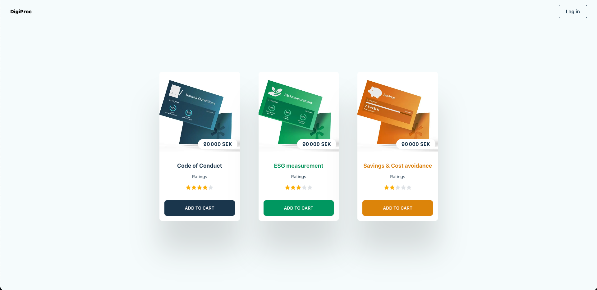

# DigiProc - Next.js E-commerce App with Mantine

This is a Next.js application built with the [Mantine](https://mantine.dev/) component library. The app enables users to browse products, view product details, register, log in, and add ratings to products.



## Features

- **Product Page**: View details of each product.
- **User Registration and Login**: Authentication for accessing personalized features.
- **Add Ratings**: Users can add ratings to products.
- **Responsive Design**: Built with Mantine for a consistent look and feel across devices.
- **Cart**: !! Feature not yet available !!

## Tech Stack

- **Frontend**: Next.js
- **Component Library**: Mantine

## Getting Started

### Prerequisites

Ensure you have the following installed:

- [Node.js](https://nodejs.org/) (v20.18 or higher)
- [Yarn](https://yarnpkg.com/) or [npm](https://www.npmjs.com/)

### Installation

2. **Clone the repository**:
   ```bash
   git clone https://github.com/Hidnish/digiproc-ui.git
   cd <your-forked-repo>

3. **Install dependencies**:
	```bash
   npm install
	 #or
   yarn install
	 ```


## Environment Variables

Create a `.env.local` file in the project root and add the following:

```dotenv
# Port for the server (change 3001 with you server PORT)
API_URL=http://localhost:3001
````

**Install dependencies**:

 ```bash
npm install
#or
yarn install
 ```
